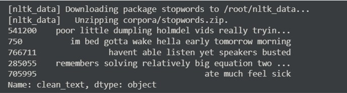
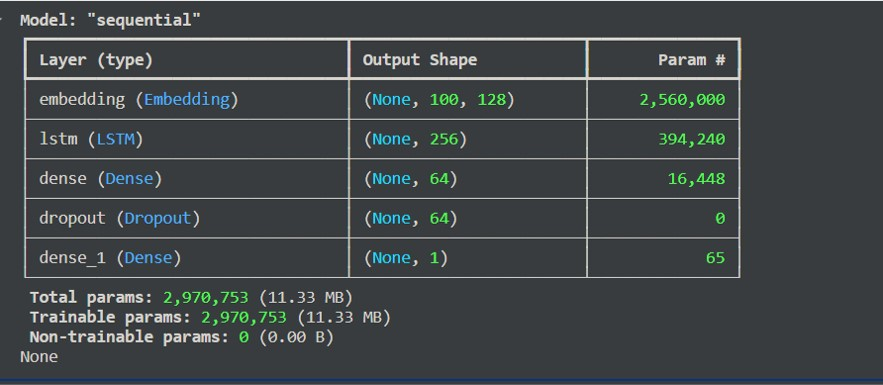
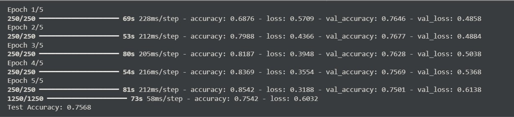
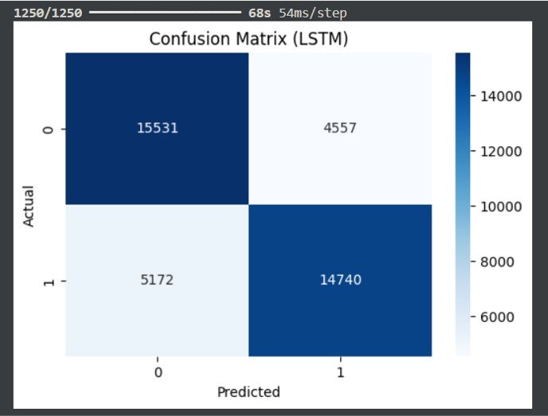
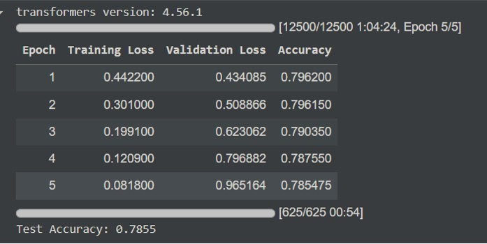
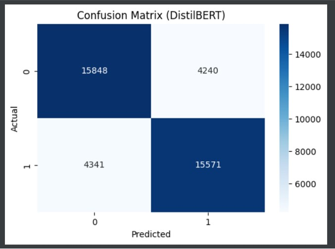
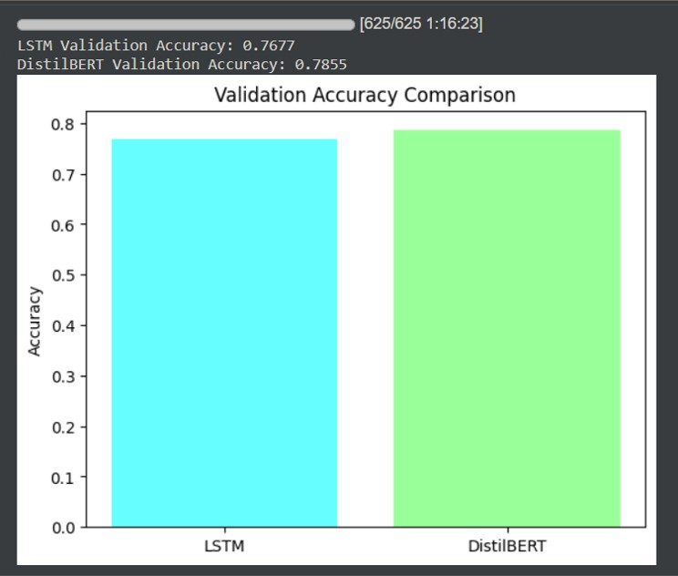

# ✨ Sentiment Analysis – Deep Learning Notebook Version


<!-- Libraries -->


---

## Overview
This project is an **enhanced version** of the original Sentiment Analysis notebook.  
It classifies text data (tweets, reviews, or short sentences) into **positive, negative, or neutral** sentiments using **Deep Learning** (LSTM / BiLSTM) and **Transformer models** (DistilBERT).  
The goal is to provide a **scalable, modern NLP solution** demonstrating the differences between classical deep learning and pretrained transformer architectures.

---

## 🎯 Project Goals
- Apply advanced NLP techniques for sentiment classification.
- Compare **LSTM / BiLSTM** with **DistilBERT** models.
- Train on a **large-scale dataset** (~1.6M tweets) for better accuracy.
- Showcase preprocessing, model training, evaluation, and visual comparison.
- Provide a professional, shareable AI portfolio piece.

---

## 📥 Dataset
- **Sentiment Analysis Dataset (1.6M tweets)**: [Download ZIP](https://nyc3.digitaloceanspaces.com/ml-files-distro/v1/sentiment-analysis-is-bad/data/training.1600000.processed.noemoticon.csv.zip)

---

## 🆚 Version Comparison

| Feature | Version 1 | Version 2 |
|---------|-----------|-----------|
| Dataset size | ~15,000 tweets | 1,600,000 tweets |
| Model | Logistic Regression | LSTM / BiLSTM + DistilBERT |
| Text preprocessing | Basic cleaning | Full cleaning + Tokenization for Transformers |
| Accuracy | ~78% | Higher, especially with BERT |
| Scalability | Limited | Can handle large datasets |
| Evaluation | Simple metrics | Comparison of LSTM vs DistilBERT with visualizations |

---

## 📦 Project Structure


```bash
📁Sentiment_Analysis_DeepLearning/
│
├─📁 notebooks/
│ └── sentiment_dl.ipynb  # Main Colab/Jupyter notebook
│
├─📁 src/
│ ├── data_loader.py      # Download dataset from external link
│ ├── preprocess.py       # Text cleaning and preprocessing
│ ├── lstm_model.py       # Build LSTM model
│ ├── bert_model.py       # Build DistilBERT model
│ └── train.py            # Training script for any model
│
├── main.py               # Main Python code
├── requirements.txt      # Required Python packages
├── LICENSE               # LICENSE file
└── README.md             # This file
```


---


## ⚙️ How to Run

### 1️⃣ LSTM / BiLSTM Experiment
```bash
python src/train.py lstm
```
- Loads the dataset, cleans text, builds LSTM, trains, and evaluates.
- Prints validation/test accuracy.

### 2️⃣ DistilBERT Experiment
```bash
python src/train.py bert
```

- Loads the dataset, tokenizes with HuggingFace tokenizer, builds DistilBERT, trains, and evaluates.

- Usually achieves higher accuracy than LSTM.

### 3️⃣ Notebook

Open notebooks/sentiment_dl.ipynb in Google Colab or Jupyter Notebook.
- Contains full experiments for:
  - LSTM / BiLSTM
  - DistilBERT
- Includes visual comparison of model performance.

## Requirements (requirements.txt)
- Python >= 3.8

 **Data processing**
- pandas
- numpy
- scikit-learn
- requests

 **NLP & Transformers**
- torch
- torchvision
- torchtext
- transformers
- evaluate

 **Text preprocessing**
- nltk
- spacy

 **Visualization**
- matplotlib
- seaborn

 **Progress bars**
- tqdm

 **Optional: for downloading large datasets**
- urllib3

- datasets

Install all requirements with:
```bash
pip install -r requirements.txt
```

or manually:
```bash
pip install pandas numpy scikit-learn nltk matplotlib tensorflow transformers datasets
```


## 📈 Model Performance

- LSTM / BiLSTM: Good baseline results, suitable for smaller resources.

- DistilBERT: Higher accuracy, better generalization, especially on large datasets.

 **Example**

| Model         | Validation Accuracy |
|---------------|---------------------|
| LSTM          | 0.85                |
| DistilBERT    | 0.92                |

 **Visual comparison available in the notebook (sentiment_dl.ipynb).**

## 🧠 Future Plans

- Extend to multilingual datasets (Arabic / English).

- Deploy models with Streamlit or Gradio for real-time predictions.

- Experiment with other transformers (BERT, RoBERTa, XLNet).

- Optimize LSTM for faster inference on resource-limited devices.

## Conclusion
Version 2 represents a significant improvement over the first version because it uses:
- Larger dataset → better learning and model performance.
- Modern Deep Learning models → LSTM + DistilBERT.
- Performance comparison → identifies the best model based on accuracy and resource usage.

---

## 📊 Visual Outputs

### 1️⃣ Data Loading


### 2️⃣ LSTM Model Build & Training


### LSTM Model Training


### LSTM Confusion Matrix


### 3️⃣ DistilBERT Model Build & Training

### DistilBERT Model Training


### DistilBERT Confusion Matrix


### 4️⃣ Performance Comparison


---

## 📌 Author
### Omar Khamis
AI & Robotics Enthusiast | Python Developer
- 💼 [LinkedIn](https://www.linkedin.com/in/omar-khamis-dev)
 | 💻 [GitHub](https://github.com/omar-khamis-dev)
- 📧 Email: omar.khamis.dev@gmail.com

---

## 📜 License
This project is licensed under the **Apache 2.0 License** – see the [LICENSE](./LICENSE) file for details.
